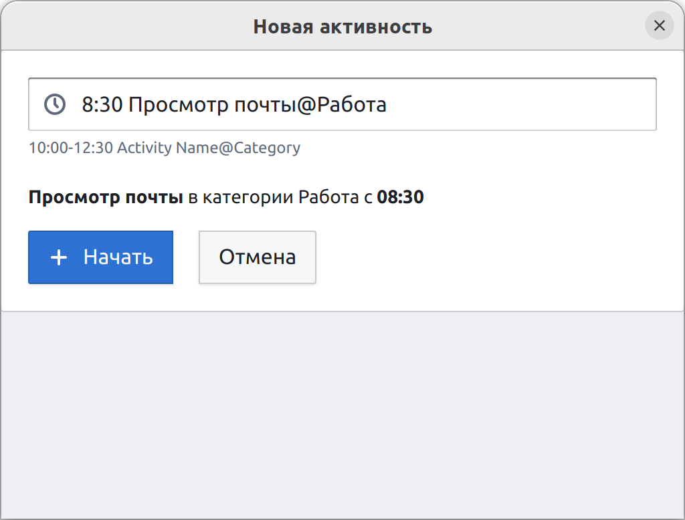
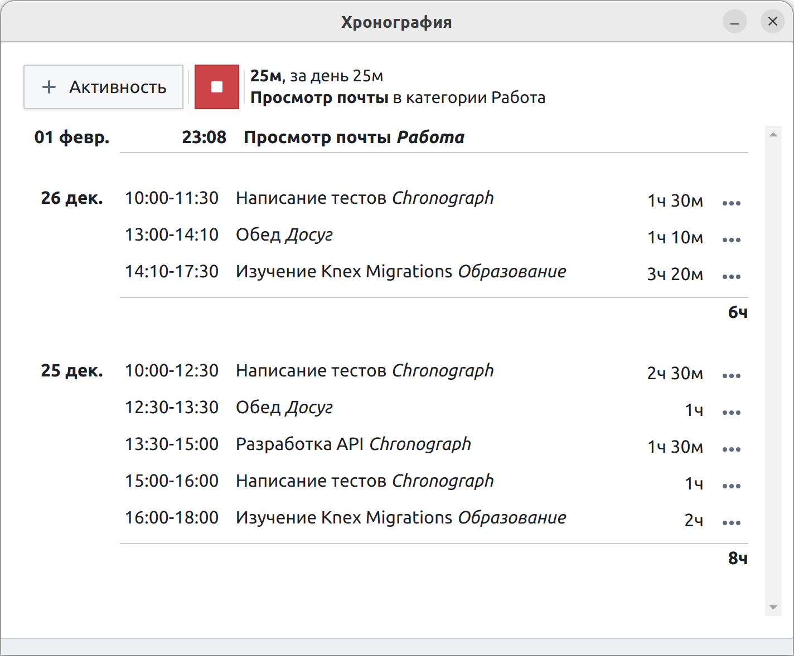

# Хронограф

Программа для отслеживания и учёта рабочего времени (тайм-трекер). С помощью этой программы можно контролировать количество времени, потраченное на выполнение каких-либо действий в течении дня.

> На данный момент Хронограф находится на начальном этапе разработки (MVP).

### Зачем?

Правильно организовать рабочее время, визуализировать затраченное время по активностям и категориям.

### Кому?

Фрилансерам, студентам, индивидуальным предпринимателям, да кому угодно! На самом деле проект я делаю для себя, чтобы прокачать навыки работы с TypeScript, ElectronJS и базой данных. Если при этом получится полезное приложение - будет отлично!

### Как?

Когда вы начинаете новое дело (Активность), например, написание документации («Документация») вы добавляете его в диалоге добавления новой активности, при этом обязательно через символ `@` написать название категории (или проекта):

```
Документация@Chronograph
```

По-умолчанию начало новой активности будет отсчитываться с текущего времени. Чтобы изменить это перед названием активности необходимо указать время дня (в формате `часы:минуты`) или отрицательное число в минутах - сколько минут назад была начата активность.

Начало работы над документацией в 10:30:

```
10:30 Документация@Chronograph
```

Начало обеда в категории `Досуг` 15 минут назад:

```
-15 Обед@Досуг
```

После сохранения формы включится таймер отсчёта с указанного времени по данной активности.

Чтобы занести в Хронограф ранее неучтённый период активности нужно указать время начала и время окончания разделённые минусом:

```
8:30-10:25 Просмотр почты@Работа
```

В этом случае таймер не будет запущен при сохранении формы, а период будет добавлен в общую хронологию дня.

При вводе активности под текстовым полем отображается подсказка с отображением времени начала активности после сохранения формы добавления.



### Окно хронографии с запущенным таймером



_Изображения интерфейса будут изменяться по мере разработки Хронографа_

Программа не использует облачное хранилище и не обращается в интернет. База данных хранится в пользовательской папке в подпапке `.chronography`. В дальнейшем будет разработана возможность организовать бэкап и выгрузить отчёты в удобном читаемом виде.

[](https://shvalyov.ru/)
